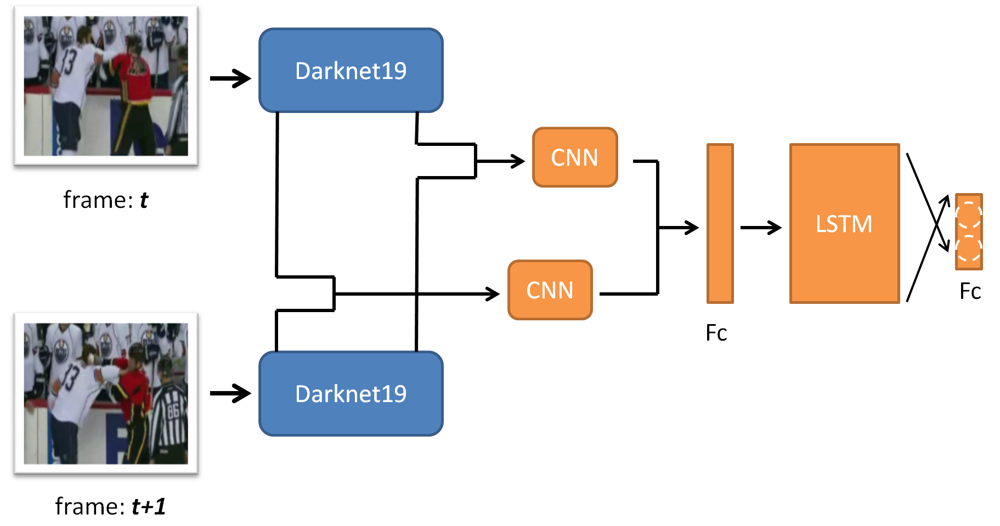

# Violence Detection by CNN + LSTM
  The proposed approach outperforms the state-of-the-art methods, while still processing the videos in real-time.
The proposed model has the following advantages:
1. The ability to use the pre-trained model on ImageNet dataset.
2. The ability to learn the local motion features by examined the concatenated two frames using CNN.
3. The ability to learn the global temporal features by LSTM cell.

## Requirement
Python3

sk-video

scikit-image

TensorFlow 1.7.0
